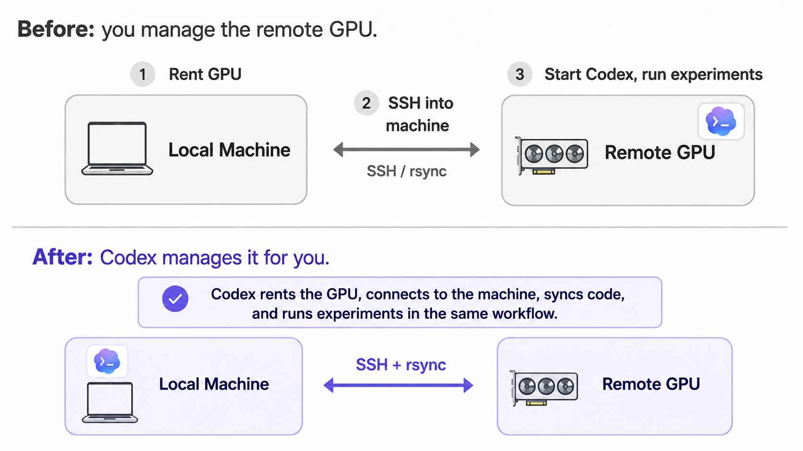
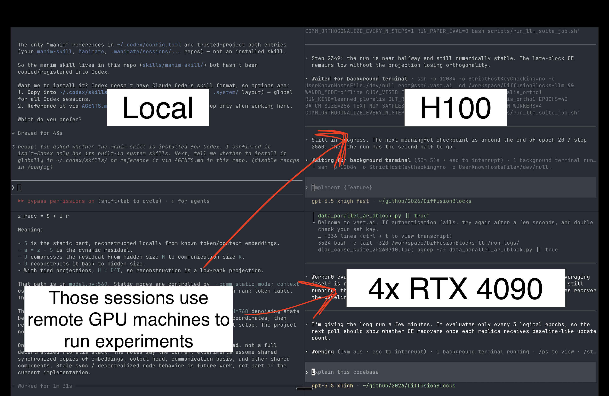

# vastai-skill

Let your AI Agents have access to GPU on [Vast.ai](https://vast.ai).

An agent rents a GPU with the native `vastai` CLI, works on it over plain `ssh`/`rsync`,
and destroys it when done. This repo provides the two missing pieces:

- **[`skills/vastai-gpu/SKILL.md`](skills/vastai-gpu/SKILL.md)** — the skill that teaches an agent the
  full workflow: find/rent → connect → sync/run → transfer artifacts → destroy.
- **`vastai-connect <instance_id>`** — the one gap the native CLI leaves: blocks until a
freshly rented instance is actually SSH-reachable, then writes a `Host` alias to its own
`~/.ssh/vastai.conf` (auto-included from `~/.ssh/config`, which is never touched again).
Optionally opens VS Code/Cursor with `--ide`.

<p align="center">
  
  
</p>

## Setup

```bash
# 1. Native vastai CLI + API key (from https://cloud.vast.ai/manage-keys/)
uv tool install vastai
vastai set api-key <key>

# 2. Register your SSH public key at https://cloud.vast.ai/manage-keys/

# 3. This tool
uv tool install git+https://github.com/Yusuke710/vastai-skill.git

# 4. The skill — same SKILL.md works for both agents; symlink it where yours looks.
#    Claude Code:
ln -s "$(pwd)/skills/vastai-gpu" ~/.claude/skills/vastai-gpu
#    Codex:
ln -s "$(pwd)/skills/vastai-gpu" ~/.agents/skills/vastai-gpu
# or ask your agent to add this skill
```

Then ask your agent for something that needs a GPU. e.g. Train a model on GPU etc

## The workflow (what the agent does)

### 1. Find and rent

```bash
vastai search offers 'gpu_name=RTX_3060 num_gpus=1 reliability>0.98' -o 'dph' --raw
vastai create instance <offer_id> --image vastai/pytorch:latest --disk 30 --ssh --raw
```

### 2. Wait until reachable

```bash
vastai-connect <instance_id> --alias vast-gpu        # blocks, then writes SSH alias
```

### 3. Work over plain ssh/rsync. This is where you iteratively run experiments on a GPU

```bash
rsync -az --filter=':- .gitignore' ./ vast-gpu:/workspace/proj/
ssh vast-gpu 'cd /workspace/proj && uv sync && uv run python train.py'
rsync -az vast-gpu:/workspace/proj/outputs/ ./outputs/
```

### 4. Destroy the instance

```bash
vastai destroy instance <instance_id>                # destroy, never stop
```

Details (long-running jobs, GPU verification, failure handling, cost rules) live in
[the skill](skills/vastai-gpu/SKILL.md).

## Connecting your IDE (optional)

Since the instance gets a plain SSH alias, VS Code or Cursor can attach to it with their
[Remote - SSH](https://code.visualstudio.com/docs/remote/ssh) extension — pick the alias
(e.g. `vast-gpu`) from the remote host list, or let the tool open it for you:

```bash
vastai-connect <instance_id> --ide code     # or --ide cursor
```

## License
MIT
